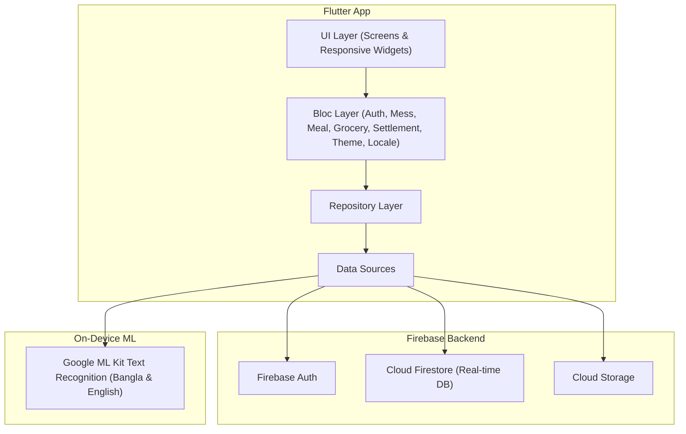

# 🍱 Meal Manager (মিল ম্যানেজার)

[](https://github.com/mddaf/mess_manager/actions/workflows/ci_cd.yml)
[](https://github.com/mddaf/mess_manager/actions/workflows/release_apk.yml)

A shared meal, grocery ("bazar"), and expense tracking mobile and web application built for hostels, flats, and student messes. No more manual spreadsheets or paper diaries — **Meal Manager** automates daily meal check-ins, grocery tracking with **handwritten & printed OCR receipt scanning** (Bangla & English), cash deposits, payment funding sources, manager rotation, and monthly settlement calculations with real-time balance tracking and dues protection.

🌐 **Live Web App**: [https://meal-manager-844f5.web.app](https://meal-manager-844f5.web.app)  
📱 **Download Latest Android APK**: [GitHub Releases](https://github.com/mddaf/mess_manager/releases)

---

## 🌟 Key Features

- **📱 Tri-Platform Support**: Responsive UI for Web, Android, and iOS devices.
- **🔑 Dynamic Mess Creation & Join**: Create a mess (auto-assigns Admin & initial Manager) or join an existing mess using a **6-character invite code**.
- **🚫 Dues & Leave Protection**: Members with unpaid carried-forward dues are blocked from leaving a mess, joining another mess, or creating a new mess until all dues are cleared.
- **🍱 Real-Time Meal Check-in**: Members and managers can toggle breakfast, lunch, and dinner (0, 0.5, 1.0) for any date with real-time Firestore synchronization.
- **🛒 Grocery Expense Logging & OCR Scanner**:
  - **📝 Quick Total & Description Mode**: Direct entry of total amount and description with category chips.
  - **🛒 Itemized Bill Breakdown Mode**: Input individual item names and prices with **instant real-time keystroke total calculation**.
  - **📸 OCR Receipt Recognition**: Auto-scans handwritten paper slips and printed receipts in both **Bangla** and **English** (Bangla numerals `১,২,৩...` supported).
  - **💳 Flexible Payment Funding Sources**: Specify whether bazar was paid from **Mess Fund**, **Purchaser's Own Pocket**, or **Split Payment**. Pocket payments automatically credit as an approved Deposit to the purchaser!
- **💵 Deposit Management & Safeguards**: Record deposits per member with automated balance calculation. Auto-created grocery reimbursement deposits are protected and editable directly from the Grocery tab.
- **📊 Automatic Settlement & Month Opening**:
  $$\text{Meal Rate} = \frac{\text{Total Grocery Cost}}{\text{Total Mess Meals}}$$
  $$\text{Member Cost} = \text{Member Meals} \times \text{Meal Rate}$$
  $$\text{Net Balance} = \text{Total Deposit} - \text{Member Cost} - \text{Carried Dues}$$
  Managers can archive active months in tabular views, roll over carried dues, and re-open consecutive archived months if adjustments are required.
- **🔄 Manager Rotation & Member Approvals**: Rotate manager duties, approve pending member joins, meal edits, and deposits.
- **🌐 Bilingual Localization**: Complete **English** and **বাংলা (Bangla)** support switchable in real time.
- **🌙 Dark & Light Themes**: Material 3 dark and light modes with Deep Forest Green styling and persistence.

---

## ⚙️ Automated GitHub Release Workflow

Instead of compiling APKs on every commit, Android APK builds are automated via **GitHub Actions** (`.github/workflows/release_apk.yml`):

- **Manual Trigger**: Go to **Actions** -> **Build & Release Android APK** -> Click **Run workflow**.
- **Release Tag Trigger**: Pushing any tag (`git tag v1.0.1 && git push origin v1.0.1`) automatically builds release APKs and publishes them directly to [GitHub Releases](https://github.com/mddaf/mess_manager/releases).

---

## ❓ What are GitHub Packages?

**GitHub Packages** is GitHub's software package hosting service for publishing and distributing code dependencies (such as Docker container images, npm libraries, Java Maven artifacts, or Dart pub packages).

For **Meal Manager**, user downloads (such as Android `.apk` files) are hosted under **GitHub Releases**, while source code and GitHub Actions workflows reside in the repository.

---

## 📌 Repository "About" Settings Guide

To set up the **About** section on GitHub ([github.com/mddaf/mess_manager](https://github.com/mddaf/mess_manager)):

1. Open the repository on GitHub.
2. Click the ⚙️ **Gear icon** next to **About** on the top right.
3. Fill in:
   - **Description**: `🍱 Modern Flutter Mess & Meal Management app for hostel/bachelor messes with OCR receipt scanner, bilingual Bangla/English support, automated monthly settlements, and dues protection.`
   - **Website**: `https://meal-manager-844f5.web.app`
   - **Topics**: `flutter`, `firebase`, `mess-manager`, `meal-calculator`, `bangladesh`, `ocr-receipt-scanner`, `dart`, `pwa`

---

## 🏗️ Architecture & Stack



---

## 📁 Folder Structure

```
mess_manager/
├── .github/
│   └── workflows/
│       ├── ci_cd.yml          # GitHub Actions CI/CD pipeline
│       └── release_apk.yml    # Manual & Tagged Android Release APK workflow
├── firestore.rules            # Firestore security rules
├── l10n.yaml                  # Localization configuration
├── pubspec.yaml               # Dependencies & assets
└── lib/
    ├── main.dart              # Entry point & Firebase setup
    ├── app.dart               # MultiBlocProvider, AppRouter & MaterialApp
    ├── l10n/                  # English & Bangla ARB files
    ├── core/                  # Theme, Router, Constants, Extensions
    ├── models/                # Freezed Dart models with Firestore converters
    ├── data/
    │   ├── repositories/      # Auth, Mess, Meal, Grocery, Deposit, Settlement
    │   └── services/          # OCR Receipt Parser, API Service
    ├── blocs/                 # Auth, Mess, Meal, Grocery, Settlement, Theme, Locale
    └── ui/
        ├── screens/           # Auth, Mess Setup, Dashboard, Meals, Grocery, Deposits, Profile
        └── widgets/           # AppDrawer, LanguageSwitcher, ThemeToggle, etc.
```

---

## 🚀 Getting Started

### Prerequisites
1. Flutter SDK `>= 3.29.0`
2. Node.js & Firebase CLI (`npm install -g firebase-tools`)

### Local Setup & Run

1. **Clone the repository**:
   ```bash
   git clone https://github.com/mddaf/mess_manager.git
   cd mess_manager
   ```

2. **Install Flutter packages**:
   ```bash
   flutter pub get
   ```

3. **Run Code Generation**:
   ```bash
   flutter gen-l10n
   dart run build_runner build --delete-conflicting-outputs
   ```

4. **Run Application**:
   ```bash
   # Run on Web
   flutter run -d chrome

   # Run on Android
   flutter run -d android
   ```

5. **Deploy Web Version**:
   ```bash
   flutter build web --release
   firebase deploy --only hosting
   ```

---

## 🧪 Testing & Code Quality

```bash
# Run unit & widget tests
flutter test

# Run static analysis
flutter analyze
```

---

## 📄 License

Distributed under the MIT License. See `LICENSE` for details.
