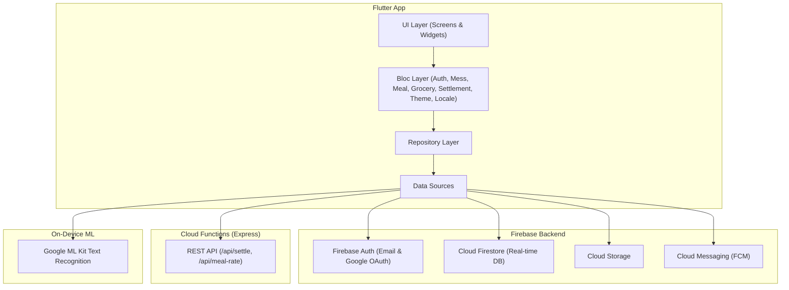

# 🍲 Mess Manager (মেস ম্যানেজার)

A shared meal, grocery ("bazar"), and expense tracking mobile and web application built for hostels, flats, and student messes. No more manual spreadsheets or diaries — Mess Manager automates daily meal check-ins, grocery tracking with **OCR receipt scanning**, cash deposits, manager rotation, and monthly settlement calculations with real-time balance tracking.

🌐 **Live Web Demo**: [https://meal-manager-844f5.web.app](https://meal-manager-844f5.web.app)

---

## 🌟 Key Features

- **📱 Tri-Platform Support**: Runs seamlessly on Android, iOS, and Web.
- **🔑 Dynamic Mess Creation & Join**: Create a mess (automatically assigns Admin & initial Manager) or join an existing mess using a **6-character invite code**.
- **🔐 Flexible Authentication**: Email/Password Sign-up & Login, plus **1-click Google Sign-In** (OAuth Popup on Web, Native Google SDK on Mobile).
- **🍱 Real-Time Meal Check-in**: Members toggle breakfast, lunch, and dinner (off `0.0`, half `0.5`, full `1.0`) with real-time Firestore sync.
- **🛒 Grocery Expense Logging & OCR**: Capture receipt photos and extract total amounts automatically using **Google ML Kit Text Recognition** (on Android/iOS with manual fallback on Web).
- **💵 Cash Deposits Tracking**: Record cash, bKash, or bank deposits per member with automated balance calculation.
- **📊 Automatic Settlement & Meal Rate Calculation**:
  $$\text{Meal Rate} = \frac{\text{Total Grocery Cost}}{\text{Total Meals Eaten}}$$
  $$\text{Member Cost} = \text{Member Meal Count} \times \text{Meal Rate}$$
  $$\text{Member Balance} = \text{Total Deposit} - \text{Member Cost}$$
- **🔄 Manager Rotation**: Easily reassign/rotate manager responsibilities between mess members.
- **🛡️ Mess Administration & Danger Zone**: Admins can kick members or permanently delete the mess and its sub-collections.
- **📈 Data Visualization**: Interactive **fl_chart** spending pie charts and breakdown summaries.
- **🌐 Bilingual Localization**: Complete **English** and **বাংলা (Bangla)** support switchable in real time.
- **🌙 Dark & Light Themes**: Material 3 dark/light modes with `SharedPreferences` persistence.
- **⏰ FCM Push Notifications**: Automated daily meal-cutoff push reminders via Firebase Cloud Messaging.

---

## 🏗️ Architecture & Stack



- **Frontend**: Flutter, Dart 3, `flutter_bloc`, `go_router`, `fl_chart`, `google_fonts`, `google_sign_in`.
- **Backend**: Firebase Auth, Cloud Firestore, Cloud Storage, Firebase Cloud Messaging (FCM).
- **REST Engine**: Node.js, Express, Firebase 2nd-Gen Cloud Functions.
- **ML / OCR**: `google_mlkit_text_recognition`.

---

## 📁 Folder Structure

```
mess_manager/
├── l10n.yaml                  # Localization config
├── pubspec.yaml               # Dependencies & assets
├── functions/                 # Cloud Functions (Express REST API)
│   ├── index.js
│   └── package.json
└── lib/
    ├── main.dart              # Firebase initialization & FCM setup
    ├── app.dart               # MultiBlocProvider, Router & MaterialApp
    ├── firebase_options.dart  # Auto-generated Firebase options
    ├── l10n/                  # English & Bangla ARB files
    ├── core/                  # Constants, enums, extensions, theme, router
    ├── models/                # Freezed Dart models with Firestore converters
    ├── data/
    │   ├── repositories/      # Auth, Mess, Meal, Grocery, Deposit, Settlement
    │   └── services/          # API, OCR, Notification services
    ├── blocs/                 # Auth, Mess, Meal, Grocery, Settlement, Theme, Locale
    └── ui/
        ├── screens/           # Auth, Mess Setup, Home, Meals, Grocery, Settlement, Deposits, Profile
        └── widgets/           # MealToggleCard, GroceryItemTile, SpendingChart, etc.
```

---

## 🚀 Getting Started

### Prerequisites
1. Flutter SDK `>= 3.8.0`
2. Node.js LTS
3. Firebase CLI (`npm install -g firebase-tools`)

### Installation & Run

1. **Clone the repository**:
   ```bash
   git clone https://github.com/your-username/mess_manager.git
   cd mess_manager
   ```

2. **Install Flutter packages**:
   ```bash
   flutter pub get
   ```

3. **Run Code Generation**:
   ```bash
   flutter gen-l10n
   dart run build_runner build --delete-conflicting-outputs
   ```

4. **Run the Application**:
   ```bash
   # Run on Web
   flutter run -d chrome

   # Run on Android
   flutter run -d android

   # Run on iOS
   flutter run -d ios
   ```

5. **Deploy Web Version**:
   ```bash
   flutter build web --release
   firebase deploy --only hosting
   ```

---

## 🧪 Verification & Testing

```bash
# Run unit & widget tests
flutter test

# Run static analysis
flutter analyze
```

---

## 📄 License

Distributed under the MIT License. See `LICENSE` for more information.
